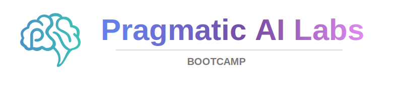

# 

<h1 align="center"><a href="https://ds500.paiml.com/bootcamps/rust">Rust Fundamentals</a></h1>
<h5 align="center">Complete Syllabus and guidelines</h5>

### Description

In this bootcamp, you will learn the fundamentals of Rust to produce a production-ready application to demonstrate real-world expertise. You will use hands-on and practical material to go beyond just theory. By the end of this bootcamp, you will be able to develop applications in Rust with best practices, creating a solid foundation to expand your knowledge.

**Teachers**
* [Noah Gift Contact & Bio](https://www.linkedin.com/in/noahgift/)
* [Alfredo Deza Contact & Bio](https://www.linkedin.com/in/alfredodeza/)

  
<b>Table of Contents</b>

   

[Rubric](./rubric.md)

* [Prerequisites](#prerequisites)
* [Week 1: Setup your Development Environment](#week-1-setup-your-development-environment)
* [Week 2: Project Structure](#week-2-project-structure)
* [Week 3: Data Structures and Advanced Types](#week-3-data-structures-and-advanced-types)
* [Week 4: Building Libraries and Testing](#week-4-building-libraries-and-testing)
* [Week 5: Command Line Applications and Best Practices](#week-5-command-line-applications-and-best-practices)
* [Week 6: Final Presentations](#week-6-final-presentations)

## Bootcamp Objectives

By the end of the bootcamp, you will be able to:

* **Master Core Rust Concepts**: Demonstrate proficiency in Rust's fundamental programming concepts including variables, control flow, and ownership
* **Apply Safety Principles**: Write safe, concurrent, and high-performance Rust code using the language's unique safety guarantees
* **Utilize Modern Development Tools**: Effectively use Rust Analyzer, Cargo, GitHub Copilot, and dev containers in professional workflows
* **Implement Best Practices**: Apply test-driven development principles and create well-documented, maintainable Rust libraries
* **Build Real Applications**: Construct practical CLI applications and libraries using Rust's ecosystem and standard library

### Bootcamp Project

This bootcamp is based on a single and individual class project. You will start
work on this project from Week 1 and will deliver the completed project with
final presentation on Week 6

### Prerequisites

This course requires basic Linux and programming skills. You can complete all
coursework with an editor of your choice. Use the following recommendations to get
up to speed on these skills.

**Linux**
If learners lack basic Linux skills it is recommended to go through this course:

* [Linux and Bash For Data Engineering](https://ds500.paiml.com/learn/course/nyu26)

**GitHub Platform**

Being able to work around and in GitHub is essential. Use these courses to get a refresher on automation, AI, and development environments:

* [Applied GitHub Platform](https://ds500.paiml.com/learn/course/7exb6)
* [GitHub Fundamentals](https://ds500.paiml.com/learn/course/mywlj)
* [Introduction to GitHub Codespaces](https://ds500.paiml.com/learn/course/a49jp)

#### Additional Resources

This bootcamp requires you to build your own project based on our Rust Starter Project template repository. You will have to copy this into your own GitHub account.

Use the [following template and go through its instructions when ready](https://github.com/paiml/rust-project-template)

This bootcamp is covered with the following courses:

* [Rust Fundamentals](https://ds500.paiml.com/learn/course/g6u1k)
* [Python and Rust with Linux Command Line Tools](https://ds500.paiml.com/learn/course/9uu8k)

You will see references to the weeks of each course so you know exactly what relevant part is needed for this Bootcamp.

## 6 week Syllabus

These are all the resources you need for this course.

> [!IMPORTANT]
> You are not required to watch and read every single resource. You aren't graded on consumption of content or memorization of
> facts. Use the content as support for your project.

### Week 0 (Optional):  Refresh your GitHub Skills

Go through the content on these courses and make sure you understand concepts like CI/CD, Codespaces, and general repository management.

* [Applied GitHub Platform](https://ds500.paiml.com/learn/course/7exb6)
* [GitHub Fundamentals](https://ds500.paiml.com/learn/course/mywlj)
* [Introduction to GitHub Codespaces](https://ds500.paiml.com/learn/course/a49jp)

### Week 1: Setup your Development Environment

[Rust Fundamentals: Week 1](https://ds500.paiml.com/course/g6u1k/1)

This week you will start by forking or copying the template repository. This repository is the foundational step for creating your Rust application by the end of this bootcamp. You will also focus on setting up your development environment.

This course uses Visual Studio Code, but you are free to change to use anything else.

* [Fork the template repository](https://github.com/paiml/ds500-rust-project-template)

**Weekly Discussion prompt:** Discuss your text editor choice and setting up the debugger. There are different debuggers available for Rust. Explain your choice.

### Week 2: Project Structure

This week you will think about your project of choice. What will you build? You will start creating the necessary files and structure for your project.

[Rust Fundamentals: Week 2](https://ds500.paiml.com/course/g6u1k/2)

**Weekly Discussion prompt:** Discuss your project idea. What will you build and why?

### Week 3: Data Structures and Advanced Types

[Rust Fundamentals: Week 3](https://ds500.paiml.com/course/g6u1k/3)

This week you will dive into Rust's powerful data structures including structs, strings, vectors, and enums. You'll learn how to define custom types, manipulate collections, and work with Rust's unique approach to data organization. Focus on implementing these concepts in your project by creating the core data structures you'll need.

I recommend this video for dealing with exhaustive matches:

* [Week 3, Lesson 3: Exhaustive Matches](https://ds500.paiml.com/course/g6u1k/3/3/7)

**Weekly Demo video prompt:** Share the structs and enums you've designed for your project. How do they model your problem domain, and what challenges did you encounter with ownership and borrowing?

### Week 4: Building Libraries and Testing

[Rust Fundamentals: Week 4](https://ds500.paiml.com/course/g6u1k/4)

This week focuses on professional Rust development practices. You'll learn to create libraries with Cargo, write comprehensive documentation, organize your code with modules, and implement thorough testing strategies. Apply test-driven development principles to your project and ensure your code is well-documented and maintainable.

Organiznig test files can be challenging if you are not used to how this happens in Rust. This is my recommended video for this week:

* [Week 4, Lesson 3: Organizing test files](https://ds500.paiml.com/course/g6u1k/4/3/2)

**Weekly Demo video prompt:** Discuss your testing strategy for your project. What types of tests are you writing (unit, integration, doc tests) and how are you organizing your test files? Share any interesting edge cases you discovered.

### Week 5: Command Line Applications and Best Practices

[Rust Fundamentals: Week 5](https://ds500.paiml.com/course/g6u1k/5)

In the final week, you'll complete your Rust project by building a command-line interface. You'll learn to handle user input, manage command-line arguments, implement proper error handling, and follow Rust CLI best practices. This is where you bring everything together into a polished, working application.

> [!IMPORTANT]
> You will have an extra buffer week to extend or complete your project. The extra week will have no video attached to it.

**Weekly Demo video prompt:** Present your completed project! Share your CLI application, discuss the challenges you overcame, and reflect on your Rust learning journey. What would you build next with Rust?

### Week 6: Final Presentations

This week is a _buffer_ week. Use it for adding and completing final details on your project and come into the Discord channel with any last questions.

Also, **congratulations**! Completing this bootcamp is something to celebrate, and we are happy you made it to the end. Good job!

* Turn in Final Project

## Resources

This repository contains links to comprehensive courses covering various aspects of modern software development, cloud computing, and artificial intelligence. The courses are organized by topic area to help you find the most relevant learning materials for your needs.

## Rust Programming References
* [Rust Fundamentals](https://ds500.paiml.com/course/g6u1k)
* [Rust For Devops](https://ds500.paiml.com/course/ex8eu)
* [Rust-Powered AWS Serverless](https://ds500.paiml.com/course/4qhhb)
* [Rust for Machine Learning Operations (LLMOps)](https://ds500.paiml.com/course/ea3st)
* [Rust Data Engineering](https://ds500.paiml.com/course/9dyuw)
* [WebSockets Foundations with Rust](https://ds500.paiml.com/course/i8xyz)

## AWS Cloud Computing References
* [AWS Certified Cloud Practitioner Preparation](https://ds500.paiml.com/course/kymo3)
* [AWS AI Analytics: Enhancing Analytics Pipelines with AI](https://ds500.paiml.com/course/um4s2)
* [Building AI Applications with Amazon Bedrock](https://ds500.paiml.com/course/qid9r)
* [Enterprise AI Operations with AWS](https://ds500.paiml.com/course/z0zae)
* [AWS Generative AI Services](https://ds500.paiml.com/course/pt180)
* [Natural Language Processing with Amazon Bedrock](https://ds500.paiml.com/course/krd8t)
* [Responsible AI and Security on AWS: Building Secure and Ethical AI Systems](https://ds500.paiml.com/course/4saal)
* [CLI Automation with AWS Cloud Shell and Amazon Q: Building Modern DevOps Workflows](https://ds500.paiml.com/course/x69qg)
* [52 Weeks of AWS: Complete Cloud Certification Journey](https://ds500.paiml.com/course/0mcoe)
* [AWS Advanced AI Engineering](https://ds500.paiml.com/course/kjcrg)
* [Generative AI and LLMs on AWS](https://ds500.paiml.com/course/sgu8g)

## Azure Cloud Computing References
* [LLMOps with Azure](https://ds500.paiml.com/course/lxulo)
* [Azure Fundamentals](https://ds500.paiml.com/course/49ibz)
* [Azure AI Fundamentals](https://ds500.paiml.com/course/n1h1s)
* [End to End LLM with Azure](https://ds500.paiml.com/course/ap1hj)
* [MLOps Platforms: Amazon SageMaker and Azure ML](https://ds500.paiml.com/course/y7ji0)

## Google Cloud Platform References
* [Google Cloud Professional Machine Learning Engineer](https://ds500.paiml.com/course/mbjn5)
* [Google Cloud Platform Certified Data Engineer](https://ds500.paiml.com/course/ebyem)
* [Authoritative GCP Professional Cloud Architect](https://ds500.paiml.com/course/1uigy)

## Artificial Intelligence and Machine Learning References
* [Generative AI with AWS](https://ds500.paiml.com/course/ehks1)
* [Natural Language AI with Bedrock](https://ds500.paiml.com/course/a8lf7)
* [Introduction to Generative AI](https://ds500.paiml.com/course/0bbb5)
* [Small Language Models](https://ds500.paiml.com/course/2pzqq)
* [Using GenAI to Automate Software Development Tasks](https://ds500.paiml.com/course/qzyhh)
* [AI Orchestration: Running Local LLMs at Scale](https://ds500.paiml.com/course/2y0qu)
* [Applied Local Large Language Models](https://ds500.paiml.com/course/vm5ox)
* [AI Orchestration with Local Models: From Development to Production](https://ds500.paiml.com/course/b5c6k)
* [Introduction to LLM Vulnerabilities](https://ds500.paiml.com/course/r1b0m)

## Data Engineering References
* [Data Engineering with Databricks](https://ds500.paiml.com/course/13cq4)
* [Databricks Engineering Mastery](https://ds500.paiml.com/course/lzjzv)
* [Scripting with Python and SQL for Data Engineering](https://ds500.paiml.com/course/jpc0r)
* [Advanced Data Engineering](https://ds500.paiml.com/course/cxxx4)
* [Linux and Bash for Data Engineering](https://ds500.paiml.com/course/nyu26)

## MLOps and DevOps References
* [Cloud Machine Learning Engineering and MLOps](https://ds500.paiml.com/course/f5sj1)
* [Agile with AI](https://ds500.paiml.com/course/31si1)
* [Cloud Virtualization, Containers and APIs](https://ds500.paiml.com/course/2qt9g)
* [DevOps, DataOps, and MLOps](https://ds500.paiml.com/course/fu7p5)
* [MLOps Tools: MLflow and Hugging Face](https://ds500.paiml.com/course/w3qih)

## GitHub and Development Tools References
* [GitHub Enterprise Administration](https://ds500.paiml.com/course/ldfsk)
* [GitHub Models](https://ds500.paiml.com/course/r06yk)
* [GitHub Fundamentals](https://ds500.paiml.com/course/mywlj)
* [Applied GitHub Platform](https://ds500.paiml.com/course/7exb6)
* [Introduction to Codespaces](https://ds500.paiml.com/course/a49jp)
* [Coding a Review Bot with AI](https://ds500.paiml.com/course/12iwz)

## Programming Languages and Systems References
* [Python and Rust with Linux Command Line Tools](https://ds500.paiml.com/course/9uu8k)
* [Python Essentials for MLOps](https://ds500.paiml.com/course/o184n)
* [Zig Systems Programming Foundations](https://ds500.paiml.com/course/wctcm)
* [Deno TypeScript Development](https://ds500.paiml.com/course/zsdey)
* [Rust GUI Development for Linux](https://ds500.paiml.com/course/qptmt)

## AI Ethics and Security References
* [Radical Ideas AI Ethics](https://ds500.paiml.com/course/pv6uj)
* [Deterministic MCP Agents: Property-Based Testing & Quality Assurance](https://ds500.paiml.com/course/deterministic-mcp-agents)

## Getting Started

Choose courses based on your current skill level and learning objectives:

- **Beginners**: Start with foundational courses like "Cloud Computing Foundations" or "Rust Fundamentals"
- **Intermediate**: Focus on specific technologies like AWS or Azure courses
- **Advanced**: Explore specialized topics like MLOps, AI Engineering, or advanced cloud architectures

### Referenced Media and Resources

* [Pragmatic AI Labs](https://paiml.com)
* [mlflow-project-best-practices](https://github.com/noahgift/mlflow-project-best-practices)
* [databricks-zero-to-mlops](https://github.com/noahgift/databricks-zero-to-mlops)
* [Python MLOps Cookbook](https://github.com/noahgift/Python-MLOps-Cookbook)
* [Edge Computer Vision](https://github.com/noahgift/edge-computer-vision)
* [Github Codespaces](https://github.com/features/codespaces)
* [AWS Academy](https://www.awsacademy.com/SiteLogin)
* [Azure for learners](https://azure.microsoft.com/en-us/developer/learners/#build)
* [Google Qwiklabs](https://www.qwiklabs.com/)
* [Practical MLOps](https://learning.oreilly.com/library/view/practical-mlops/9781098103002/)

#### Optional Supplementary Readings & Media

* [AWS Bootcamp](https://github.com/noahgift/aws-bootcamp)
* Gift, N (2020) [Python for DevOps](https://learning.oreilly.com/library/view/python-for-devops/9781492057680/) Sebastopol, CA: O'Reilly.
* Gift, N (2021) [Practical MLOps](https://learning.oreilly.com/library/view/practical-mlops/9781098103002/), Sebastopol, CA: O'Reilly
* Gift, N (2021) [Cloud Computing for Data Analysis](https://paiml.com/docs/home/books/cloud-computing-for-data/)
* Gift, N (2020) [Pragmatic AI:  An Introduction to Cloud-Based Machine Learning](https://learning.oreilly.com/library/view/pragmatic-ai-an/9780134863924/)
* [AWS Training & Certification](https://www.aws.training/)
* [AWS Educate](https://www.awseducate.com/educator/s/pathways)
* [AWS Academy](https://aws.amazon.com/training/awsacademy/)
* [Google Qwiklabs - Hands-On Cloud Training](https://www.qwiklabs.com/)
* [Coursera](https://www.coursera.org/)
    * [Google Cloud Platform Fundamentals: Core Infrastructure](https://www.coursera.org/learn/gcp-fundamentals)
* [Microsoft Learn](https://docs.microsoft.com/en-us/learn/)
* [edX](https://www.edx.org/)
* Applied Computer Vision with Python Lectures: [https://learning.oreilly.com/videos/applied-computer-vision/60652VIDEOPAIMLL/](https://learning.oreilly.com/videos/applied-computer-vision/60652VIDEOPAIMLL/)
* Learn Python in One Hour:  [https://learning.oreilly.com/videos/learn-python-in/60645VIDEOPAIML/](https://learning.oreilly.com/videos/learn-python-in/60645VIDEOPAIML/)
* Cloud Computing with Python: [https://learning.oreilly.com/videos/cloud-computing-with/60650VIDEOPAIML/](https://learning.oreilly.com/videos/cloud-computing-with/60650VIDEOPAIML/)
* Python for Data Science with Colab and Pandas in One Hour:  [https://learning.oreilly.com/videos/python-for-data/62062021VIDEOPAIML/](https://learning.oreilly.com/videos/python-for-data/62062021VIDEOPAIML/)
* GCP Cloud Functions: \
[https://learning.oreilly.com/videos/learn-gcp-cloud/50101VIDEOPAIML/](https://learning.oreilly.com/videos/learn-gcp-cloud/50101VIDEOPAIML/)
* Azure AutoML \
[https://learning.oreilly.com/videos/learn-azure-ml/50104VIDEOPAIML/](https://learning.oreilly.com/videos/learn-azure-ml/50104VIDEOPAIML/)

##### AWS

* AWS Cloud Practitioner
    * AWS Certified Cloud Practitioner Video Course: [https://learning.oreilly.com/videos/aws-certified-cloud/60644VIDEOPAIML/](https://learning.oreilly.com/videos/aws-certified-cloud/60644VIDEOPAIML/)
    * [https://learning.oreilly.com/library/view/cloud-computing-for/20201229PAIML/](https://learning.oreilly.com/library/view/cloud-computing-for/20201229PAIML/)
    * [https://learning.oreilly.com/videos/aws-in-one/61092021VIDEOPAIMLL/](https://learning.oreilly.com/videos/aws-in-one/61092021VIDEOPAIMLL/)
* AWS ML
    * [https://learning.oreilly.com/videos/aws-certified-machine/9780135556597/](https://learning.oreilly.com/videos/aws-certified-machine/9780135556597/)
    * [https://learning.oreilly.com/videos/aws-machine-learning/61232021VIDEOPAIML/](https://learning.oreilly.com/videos/aws-machine-learning/61232021VIDEOPAIML/)
* AWS SA
    * [https://learning.oreilly.com/videos/aws-solutions-architect/61132021VIDEOPAIML/](https://learning.oreilly.com/videos/aws-solutions-architect/61132021VIDEOPAIML/)

##### GCP

* Building AI Applications with GCP: [https://learning.oreilly.com/videos/building-ai-applications/9780135973462/](https://learning.oreilly.com/videos/building-ai-applications/9780135973462/)
* Build GCP Cloud Functions:

    [https://learning.oreilly.com/videos/learn-gcp-cloud/50101VIDEOPAIML/](https://learning.oreilly.com/videos/learn-gcp-cloud/50101VIDEOPAIML/)

##### Python

* Data Science, Pandas, and Colab

[https://learning.oreilly.com/videos/python-for-data/62062021VIDEOPAIML/](https://learning.oreilly.com/videos/python-for-data/62062021VIDEOPAIML/)

* Python and DevOps  \
[https://learning.oreilly.com/videos/python-devops-in/61272021VIDEOPAIML/](https://learning.oreilly.com/videos/python-devops-in/61272021VIDEOPAIML/)
* Python Command-line Tools \
[https://learning.oreilly.com/videos/learn-python-command-line/50102VIDEOPAIML/](https://learning.oreilly.com/videos/learn-python-command-line/50102VIDEOPAIML/)

##### Linux and Systems Engineering

* Docker containers: \
[https://learning.oreilly.com/videos/learn-docker-containers/50103VIDEOPAIML/](https://learning.oreilly.com/videos/learn-docker-containers/50103VIDEOPAIML/)
* Learn the Vim Text Editor:

    [https://learning.oreilly.com/videos/learn-vim-in/50100VIDEOPAIML/](https://learning.oreilly.com/videos/learn-vim-in/50100VIDEOPAIML/)

### Assignment Overview and Feedback Breakdown

Grading and feedback turnaround will be one week from the due date. You will be notified if the turnaround will be longer than one week.

The discussion forums, written assignments, demo videos, and final project will be graded based on specific criteria or a rubric. The criteria or rubric for each type of assessment will be available in the course.

#### Late Work Policy

This bootcamp is meant for learners to be fully accountable and responsible for their work. At the end of the bootcamp, your project is your accomplishment. There is no specific grading or tests. The artifact you produce is the validation of completion of this bootcamp and its contents.

### Online Communication and Interaction Expectations

#### Discussion Forums

The purpose of the discussion boards is to allow learners to freely exchange ideas. It is imperative to remain respectful of all viewpoints and positions and, when necessary, agree to respectfully disagree. While active and frequent participation is encouraged, cluttering a discussion board with inappropriate, irrelevant, or insignificant material will not earn additional points and may result in receiving less than full credit. Frequency matters, but contributing content that adds value is paramount. Please remember to cite all sources—when relevant—in order to avoid plagiarism. Please post your viewpoints first and then discuss others’ viewpoints.

The quality of your posts and how others view and respond to them are the most valued. A single statement mostly implying “I agree” or “I do not agree” is not counted as a post. Explain, clarify, politely ask for details, provide details, persuade, and enrich communications for a great discussion experience. Please note, there is a requirement to respond to at least two fellow class members’ posts. Also, remember to cite all sources—when relevant—in order to avoid plagiarism.

> [!IMPORTANT]
> Failure to meet minimum standards of online communication might get your access revoked

#### Online Communication Etiquette

Beyond interacting with your instructor and peers in discussions, you will be expected to communicate primarily by Discords messages, and in the weekly sync sessions.

Just as you expect a response when you send a message to your instructor, please respond promptly when your instructor contacts you. Your instructor will expect a response within two business days. This will require that you log into the course site regularly and set up your notifications to inform you when the instructor posts an announcement, provides feedback on work or sends you a message.

> [!IMPORTANT]
> Failure to meet minimum standards of online communication might get your access revoked

#### Participation and Attendance

This bootcamp will meet at a particular day and time each week. Attendance is not mandatory and is meant to discuss project progress, prodivde feedback, and do general Q&A. Your attendance does not affect your bootcamp completion.

### Course Technology

This course will involve a number of different types of interactions. These interactions will take place primarily through Discord and Zoom for weekly check-ins and willl use the [Pragmatic AI Labs](https://ds500.paiml.com/) platform for video content. Please take the time to navigate through the course and become familiar with the course syllabus, structure, and content and review the list of resources.

## Support

For questions about specific courses or technical support, please visit the course platform at [ds500.paiml.com](https://ds500.paiml.com).
